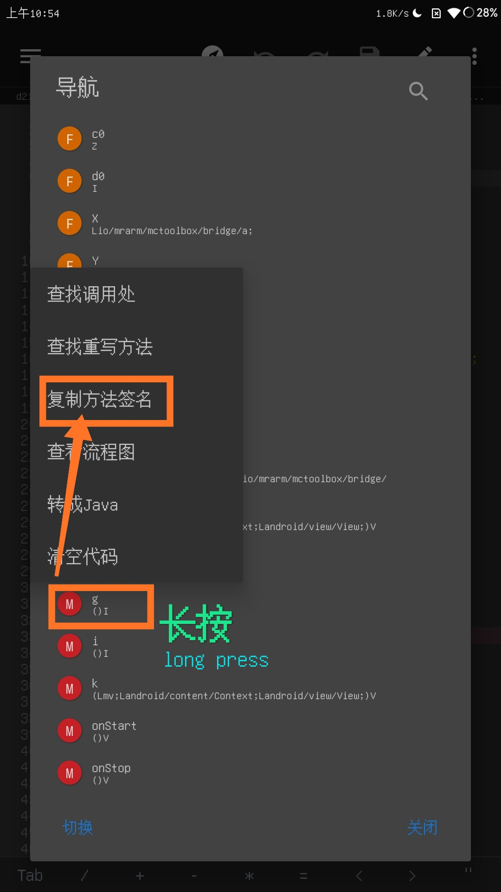

# 加时教程
## 目录
> [手动加时](#sdjs)
> [自动加时](#zdjs)
<a id="sdjs"></a>
## ◎手动加时
### 添加addtime函数
1. 打开activity记录


2. 进入游戏并记录activity名称


3. 编辑dex


- 下面的 "**d21**" 是你记录的activity名字





- 在最下面写这段代码
  ```java
  .method public addtime(Landroid/view/View;)V
      .registers 3
  
      invoke-static {}, {sign}
  
      return-void
  .end method
  ```
- 把{sign}替换成你复制的方法签名


- 保存并退出
### 反资源混淆
- 打开**NP管理器**
- 找到apk文件
- 打开，点功能，点RES反资源混淆


### 添加加时按钮
- 回到MT
1. 打开ui的xml文件


- /res/layout-v21/toolbox_overlay.xml


2. 反编译


3. 在指定位置写入下面这段代码
  ```xml
    <ImageView
                android:background="@7F08011F"
                android:layout_width="-2"
                android:layout_height="-2"
                android:layout_marginBottom="16dp"
                android:src="@7F080097"
                android:onClick="addtime"
                app:tint="#FFFFFFFF" />
  ```
- 如图
- 
  
  
4. 保存并退出


5. 安装并打开


6. 可以加时了

----
<a id="zdjs"></a>
## ◎自动加时
### 获取加时代码
1. 记录activity名称
2. 打开dex搜索类名并找到方法g
- 以上请见[手动加时](#sdjs)
3. 复制代码下图中的代码(就是方法g里面的代码)


4. 搜索字符串internal/premium/remaining_time


5. 搜索结果一个一个去看(或直接在结果中搜索方法a)，直到找到方法名是a的(就像下面的)


6. 如图，删掉绿色横线里面原来的内容，替换成第3步复制的代码


7. 如图，找到MinecraftActivity，并添加第3步的代码


- 在方法onCreate开头添加代码


8. 保存并退出
9. 安装并打开
10. 可以自动加时了

